# DevSecOps CI/CD Pipeline (Jenkins  → SonarQube + Dependency-Check + Trivy → Security Gates → GitOps Deploy)

This project is my **DevSecOps CI/CD pipeline** built for a real ops workflow:
- I build and test the app
- I scan code + dependencies + container image
- I enforce **security gates** (the pipeline fails if risk is too high)
- I deploy through a GitOps-style flow (Argo CD watches manifests)

Everything here is written to work with **Jenkins running on Ubuntu inside WSL**.

---

## Problem (Real “Ops” Scenario)

In production, deployments move fast — but security problems move faster.

A common scenario:
- a “small change” gets merged
- the build passes
- but the change introduces:
  - a vulnerable dependency (CVE)
  - an insecure code issue / security hotspot
  - a container image with High/Critical vulnerabilities

If we deploy without gates, we risk:
- a security incident
- emergency rollback
- downtime + alerts + “what happened?” calls

So I need a pipeline that:
- runs the same security checks every time
- blocks risky releases automatically
- keeps proof (scan reports + rollout evidence)

---

## Solution

I implemented a pipeline with these stages:

1. **Checkout + Unit Tests**
2. **SonarQube Scan** (code quality + security)
3. **OWASP Dependency-Check** (dependency CVEs)
4. **Build Docker image**
5. **Trivy Image Scan** (container CVEs)
6. **Security Gates**
   - fail the pipeline if thresholds are exceeded
7. **GitOps Deploy**
   - Jenkins updates the image tag in GitOps manifests
   - Argo CD syncs and deploys to Kubernetes
8. **Proof**
   - reports stored in `reports/`
   - screenshots stored in `screenshots/`

---

## Architecture Diagram

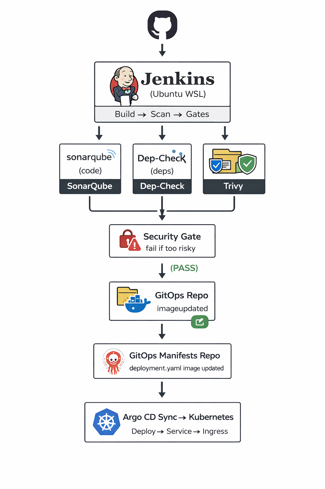

---

## Step-by-step CLI 

> Assumptions:

* Jenkins is running on **Ubuntu WSL**
* Docker available in WSL (Docker Desktop WSL integration or Docker engine)
* Deploy to Kubernetes (Minikube or any cluster)

---

### Step 1 — Create the project structure

```bash
mkdir -p devsecops-cicd-pipeline/{app/src,app/tests,jenkins/scripts,k8s/base,k8s/argocd,gitops/myapp,reports/{trivy,dependency-check,sonar},screenshots}
cd devsecops-cicd-pipeline
```

✅ Screenshot:

* `screenshots/01-project-structure.png`
* What it should show: `tree -L 3` output with folders

```bash
tree -L 3
```


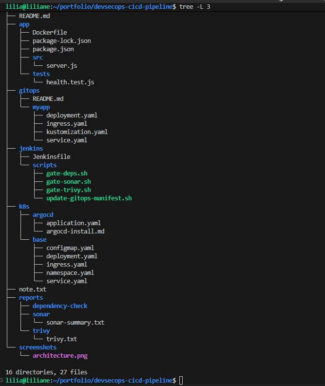


---

## SonarQube Setup (WSL + Jenkins)

### Step 2 — Run SonarQube in Docker (WSL)

SonarQube uses Elasticsearch, so set this first:

```bash
sudo sysctl -w vm.max_map_count=262144
echo "vm.max_map_count=262144" | sudo tee -a /etc/sysctl.conf
```

Run SonarQube:

```bash
docker network create devsecops-net >/dev/null 2>&1 || true

docker run -d --name sonarqube \
  --network devsecops-net \
  -p 9000:9000 \
  -e SONAR_ES_BOOTSTRAP_CHECKS_DISABLE=true \
  sonarqube:community
```

Verify:

```bash
curl -s http://localhost:9000/api/system/status
```

Open UI:

* `http://localhost:9000`
  Login:
* `admin / admin` (then change password)

✅ Screenshot:

* `screenshots/02-sonarqube-running.png`
* What it should show: SonarQube UI loading (login/dashboard)


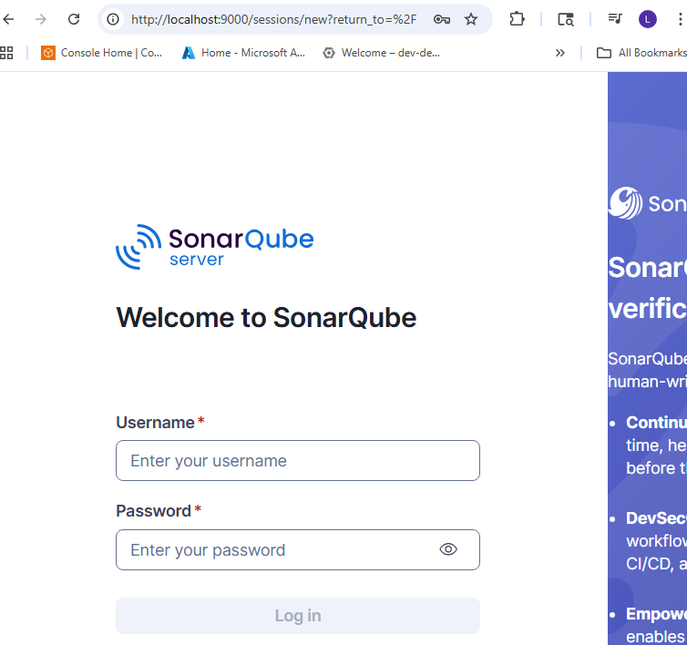


---

### Step 3 — Create Sonar token

In SonarQube UI:

* My Account → Security → Generate Token
* Name: `jenkins-token`
* Copy it

✅ Screenshot:

* `screenshots/03-sonarqube-token.png`
* What it should show: token created (don’t expose full token publicly)


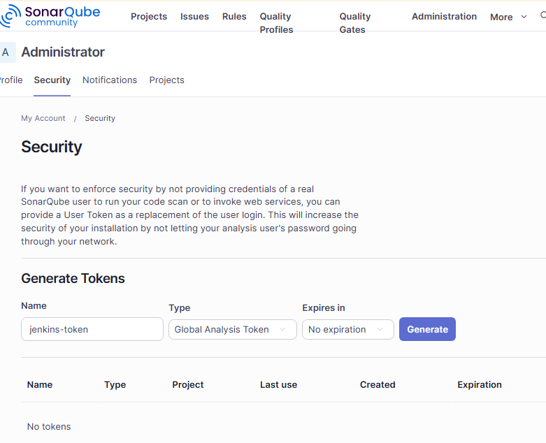


---

### Step 4 — Configure SonarQube in Jenkins (WSL)

Jenkins UI:

* Manage Jenkins → Credentials → (Global) → Add Credentials

  * Kind: Secret text
  * Secret: (paste Sonar token)
  * ID: `sonar-token`

Jenkins UI:

* Manage Jenkins → System → SonarQube installations → Add

  * Name: `MySonar`
  * Server URL: `http://localhost:9000`
  * Server authentication token: `sonar-token`

✅ Screenshot:

* `screenshots/04-jenkins-sonar-config.png`
* What it should show: Jenkins SonarQube installation configured 


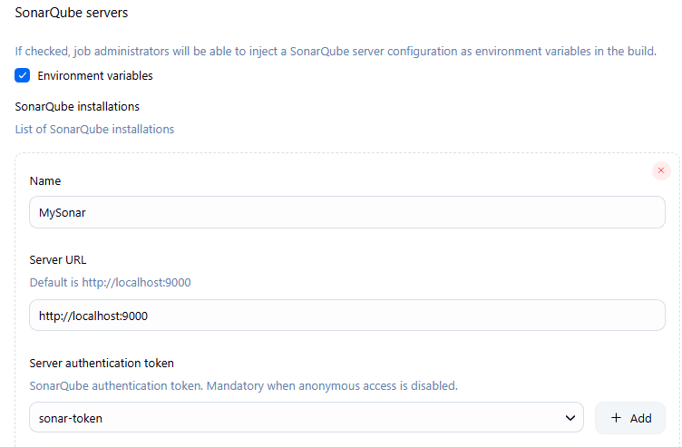


---

### Step 5 — Add SonarQube Scanner tool in Jenkins

Jenkins UI:

* Manage Jenkins → Tools → SonarQube Scanner

  * Name: `SonarScanner`
  * Install automatically ✅

✅ Screenshot:

* `screenshots/05-jenkins-sonar-scanner.png`
* What it should show: Sonar scanner tool configured


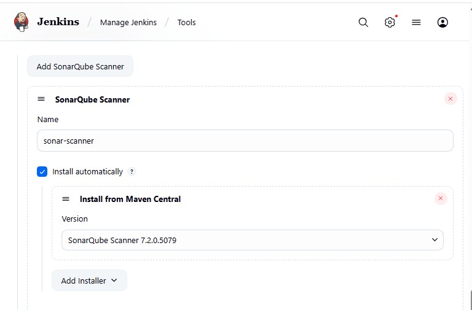


---

### Step 6 — Add Sonar webhook (Quality Gate support)

If Docker engine is in WSL (common with Docker Desktop + WSL2 integration), then Jenkins is reachable via the WSL IP.

Get WSL IP:
```bash
hostname -I | awk '{print $1}'
```

In SonarQube Webhook URL use:

`http://<WSL_IP>:8080/sonarqube-webhook/`

SonarQube UI:

* Administration → Configuration → Webhooks → Create

  * Name: `jenkins-webhook`
  * URL: `http://<WSL_IP>:8080/sonarqube-webhook/`   or   
         `http://localhost:8080/sonarqube-webhook/`  

✅ Screenshot:

* `screenshots/06-sonar-webhook.png`
* What it should show: webhook added in SonarQube


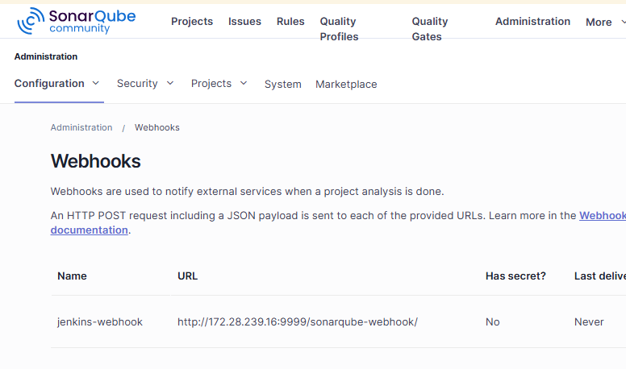


---

## Dependency-Check Setup

### Step 7 — Run OWASP Dependency-Check (Docker)

* Run Dependency-Check in Jenkinsfile
Can do it either with:

the Jenkins plugin step, or

the CLI inside the build container/agent

```bash
mkdir -p .dc-data reports/dependency-check

docker run --rm \
  -v "$(pwd)/app":/src \
  -v "$(pwd)/reports/dependency-check":/report \
  -v "$(pwd)/.dc-data":/usr/share/dependency-check/data \
  owasp/dependency-check:latest \
  --scan /src \
  --format "HTML" \
  --out /report
```

* Or Install the plugin 

In Jenkins:
Manage Jenkins → Plugins → Available

* install OWASP Dependency-Check Plugin

✅ Screenshot:

* `screenshots/07-dependency-check-report.png`
* What it should show: the HTML report opened OR terminal showing report generated


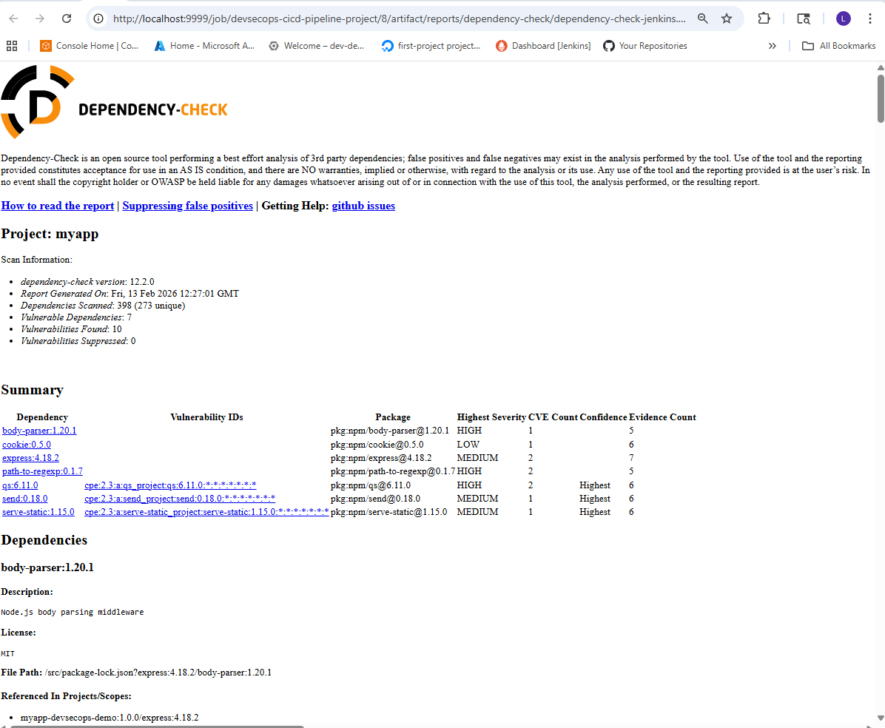


---

## Trivy Setup

### Step 8 — Install Trivy in WSL

```bash
sudo apt-get update
sudo apt-get install -y wget gnupg lsb-release

wget -qO - https://aquasecurity.github.io/trivy-repo/deb/public.key | sudo apt-key add -
echo "deb https://aquasecurity.github.io/trivy-repo/deb $(lsb_release -sc) main" | \
  sudo tee -a /etc/apt/sources.list.d/trivy.list

sudo apt-get update
sudo apt-get install -y trivy
trivy --version
```

✅ Screenshot:

* `screenshots/08-trivy-installed.png`
* What it should show: `trivy --version`


---

## NGINX Setup (Kubernetes Ingress)

### Step 9 — Start Minikube and enable Ingress-NGINX

```bash
minikube start
minikube addons enable ingress
kubectl get pods -n ingress-nginx
```

✅ Screenshot:

* `screenshots/09-ingress-controller-running.png`
* What it should show: ingress controller pod Running


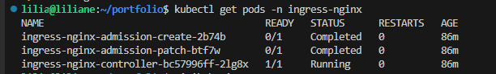


---

## Deploy the App (baseline)

### Step 10 — Deploy app manifests

## Build and push image (manual proof)
```bash
docker build -t laly9999/myapp:1 app/
docker push laly9999/myapp:1
```

## Apply manifest
```bash
kubectl apply -f k8s/base/namespace.yaml
kubectl apply -n devsecops-demo -f k8s/base/
kubectl get pods -n devsecops-demo -o wide
```

# Confirm ingress-nginx controller service
```bash
kubectl get svc -n ingress-nginx
```
# Port-forward 80 and 443 to your Windows localhost
```bash
#kubectl -n ingress-nginx port-forward svc/ingress-nginx-controller 8080:80 8443:443 --address 0.0.0.0
kubectl -n ingress-nginx port-forward svc/ingress-nginx-controller 8080:80 --address 0.0.0.0
```

# Update Windows hosts file (point to localhost, not Minikube IP)

In Windows C:\Windows\System32\drivers\etc\hosts, set:
`notepad C:\Windows\System32\drivers\etc\hosts`
127.0.0.1  myapp.local

# Update Linux hosts file 
`sudo vim /etc/hosts`
127.0.0.1  myapp.local


Open your app in Windows browser
`http://myapp.local:8080`

✅ Screenshot:

* `screenshots/10-pods-ready.png`
* What it should show: App Running on browser


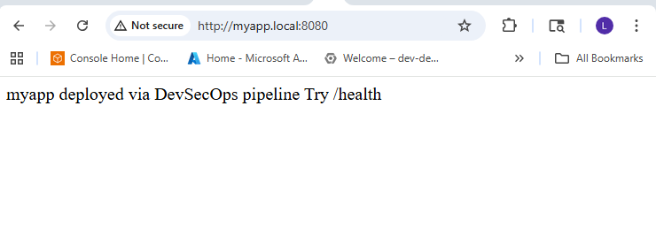


---

### Step 11 — Verify service health

```bash
curl -i http://myapp.local:8080/health

```

✅ Screenshot:

* `screenshots/11-service-working.png`
* What it should show: curl output (200 OK / JSON)

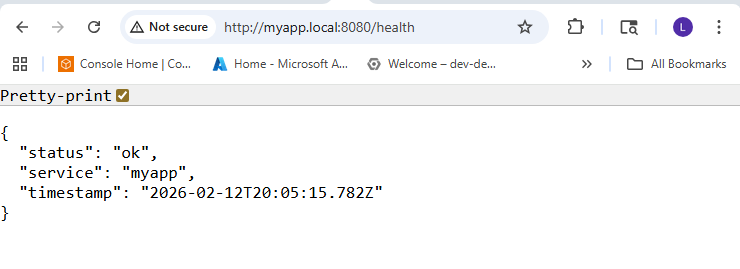


---

## Jenkins Pipeline Run (Proof)

### Step 12 — Run Jenkins pipeline (Build → Scan → Gate)

Run Jenkins job connected to this repo.

✅ Screenshot:

* `screenshots/12-jenkins-pipeline-stages.png`
* What it should show: stages including SonarQube + Dependency-Check + Trivy


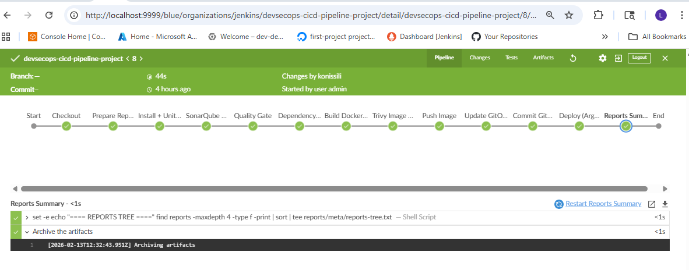


---

## GitOps Deploy Proof (Argo CD)

### Step 13 — Create Argo CD Application

```bash

# -----------------------------
# 1) Install Argo CD
# -----------------------------
kubectl create namespace argocd

kubectl apply -n argocd \
  -f https://raw.githubusercontent.com/argoproj/argo-cd/stable/manifests/install.yaml

kubectl get pods -n argocd
kubectl wait -n argocd --for=condition=Ready pod --all --timeout=300s

# -----------------------------
# 2) Get initial admin password (first-time login)
# -----------------------------
# Option A: from secret
kubectl -n argocd get secret argocd-initial-admin-secret \
  -o jsonpath="{.data.password}" | base64 -d; echo

# Option B: from argocd-server (works even if secret exists)
kubectl -n argocd exec deploy/argocd-server -- argocd admin initial-password

# -----------------------------
# 3) Access Argo CD UI (easy way)
# -----------------------------
# Keep this running in a terminal while you use the UI:
kubectl -n argocd port-forward svc/argocd-server 8085:443

# Open in browser:
# https://localhost:8085
# user: admin
# pass: (from Step 2)


# 4) Create an Argo CD Application (GitOps)
# -----------------------------
REPO_URL="https://github.com/<YOUR_GITHUB>/<YOUR_REPO>.git"
APP_PATH="gitops/myapp"
APP_NAME="myapp-devsecops"
DEST_NS="devsecops-demo"

# Ensure destination namespace exists:
kubectl create namespace $DEST_NS --dry-run=client -o yaml | kubectl apply -f -

# Create app via CLI:
argocd app create $APP_NAME \
  --repo $REPO_URL \
  --path $APP_PATH \
  --dest-server https://kubernetes.default.svc \
  --dest-namespace $DEST_NS

# Turn on auto-sync (optional but recommended):
argocd app set $APP_NAME --sync-policy automated --auto-prune --self-heal

# Sync now:
argocd app sync $APP_NAME
argocd app wait $APP_NAME --health

# Verify in cluster:
kubectl get all -n $DEST_NS
kubectl get ingress -n $DEST_NS


```

✅ Screenshot:

* `screenshots/13-argocd-app-synced.png`
* What it should show: app is Synced + Healthy


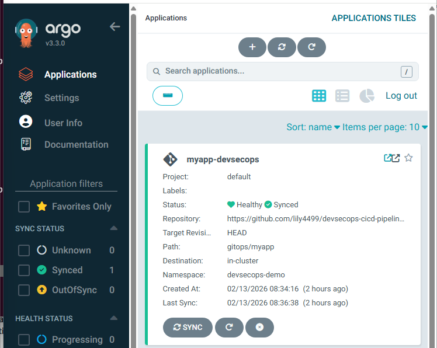


---

### Step 14 — Rollout proof

```bash
kubectl rollout status deploy/myapp -n devsecops-demo
kubectl get pods -n devsecops-demo
```

✅ Screenshot:

* `screenshots/14-rollout-status.png`
* What it should show: rollout succeeded


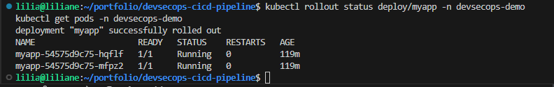


---

## Outcome

With this setup, I get:

* automated code + dependency + image scanning
* security gates that stop risky releases
* reports saved to `reports/`
* GitOps deployment with Argo CD for consistent cluster state
* clear proof for portfolio screenshots

---

## Troubleshooting

### SonarQube not starting (Elasticsearch error)

```bash
sudo sysctl -w vm.max_map_count=262144
docker restart sonarqube
docker logs -f sonarqube
```

### Jenkins can’t reach SonarQube

From WSL:

```bash
curl -s http://localhost:9000/api/system/status
```

If Jenkins is containerized and Sonar is containerized:

* use `http://sonarqube:9000` (same docker network)

### Quality Gate stage hangs/fails

* Confirm webhook exists in SonarQube:

  * `http://localhost:8080/sonarqube-webhook/`

### Dependency-Check slow

* Keep `.dc-data` cache folder (already in steps)
* Re-run after first warm-up

### Ingress 404/503

```bash
kubectl describe ingress -n devsecops-demo
kubectl get endpoints -n devsecops-demo
kubectl logs -n ingress-nginx deploy/ingress-nginx-controller --tail=80
```

---

## Next Improvements (Optional)

* SBOM generation (Syft) + image signing (Cosign)
* secret scanning (Gitleaks)
* policy gates (OPA Conftest / Kyverno)
* Slack alerts on gate failures
* promote images across dev → staging → prod with approvals


