# DevSecOps CI/CD Pipeline

**Jenkins → SonarQube + Dependency-Check + Trivy → Security Gates → GitOps Deploy**

## Context

This project shows how I built a **DevSecOps CI/CD pipeline** for a real operations workflow.

The idea is simple: shipping fast is good, but shipping insecure code is dangerous. So instead of only building and deploying an application, I added security checks directly into the pipeline.

In this setup, I:

* build and test the application
* scan source code for quality and security issues
* scan dependencies for known CVEs
* scan the container image for vulnerabilities
* enforce security gates
* deploy using a GitOps-style workflow with Argo CD

Everything here was built to work with **Jenkins running on Ubuntu inside WSL**.

---

## Problem

In a real production environment, teams deploy changes often. The problem is that security issues can easily move with those changes if there are no controls in place.

A common ops scenario looks like this:

* a developer pushes a small update
* the build succeeds
* but the release contains:

  * a vulnerable package
  * insecure code
  * a container image with High or Critical CVEs

If that change reaches production, it can cause:

* security incidents
* emergency fixes
* failed deployments
* downtime
* late-night troubleshooting

The real problem is not only finding vulnerabilities. The real problem is **stopping risky releases automatically before they reach the cluster**.

---

## Solution

I built a DevSecOps pipeline that adds security checks into the normal CI/CD flow.

The pipeline works like this:

1. Jenkins pulls the code
2. the application is tested
3. SonarQube checks code quality and security findings
4. Dependency-Check scans libraries for known vulnerabilities
5. Docker builds the container image
6. Trivy scans the image for High/Critical issues
7. security gates decide whether the pipeline can continue
8. Jenkins updates the GitOps deployment manifest
9. Argo CD detects the change and deploys it to Kubernetes

This approach gives me:

* repeatable scanning
* automatic blocking of risky releases
* proof of security checks
* proof of deployment rollout
* cleaner and safer release flow

---

## Architecture

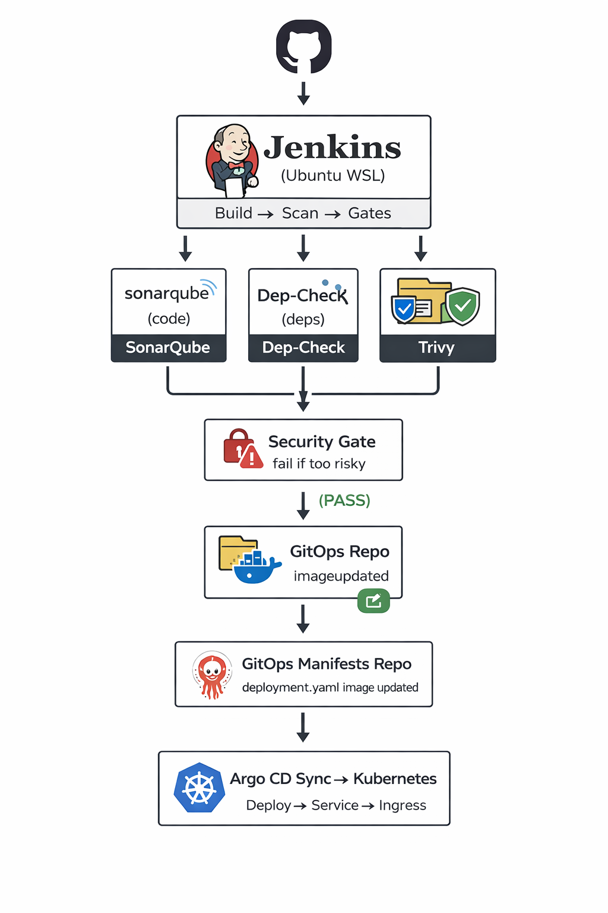

---

## Workflow with goals + screenshots

### 1. Project structure ready

**Goal:** Start with a clean project layout for app code, pipeline logic, Kubernetes manifests, reports, and screenshots.

**Screenshot used:**

* `screenshots/01-project-structure.png`
  **Should show:** project folders organized for app, Jenkins, Kubernetes, reports, and screenshots.

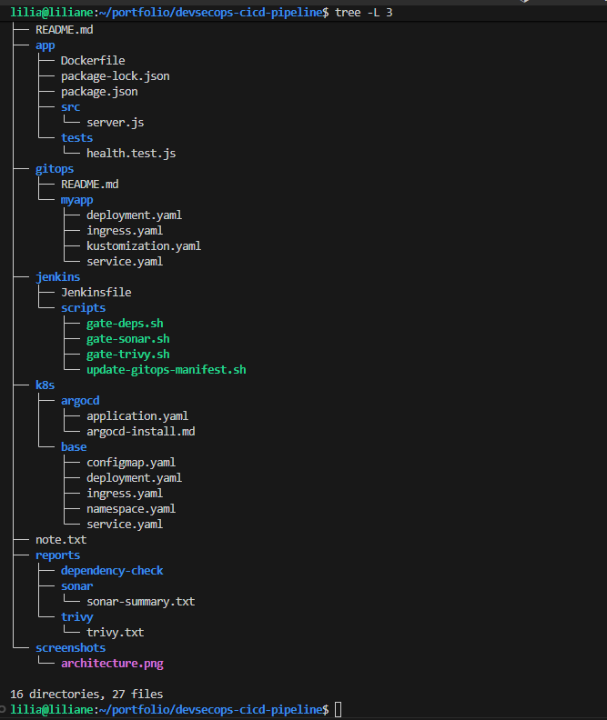

---

### 2. SonarQube running

**Goal:** Bring up SonarQube so the pipeline can scan source code for code quality, bugs, and security issues.

**Screenshot used:**

* `screenshots/02-sonarqube-running.png`
  **Should show:** SonarQube UI running and accessible.

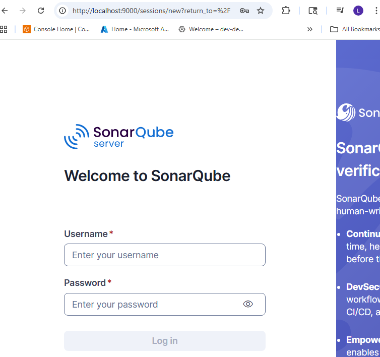

---

### 3. Sonar token created

**Goal:** Generate an authentication token so Jenkins can connect securely to SonarQube.

**Screenshot used:**

* `screenshots/03-sonarqube-token.png`
  **Should show:** Sonar token created in SonarQube.

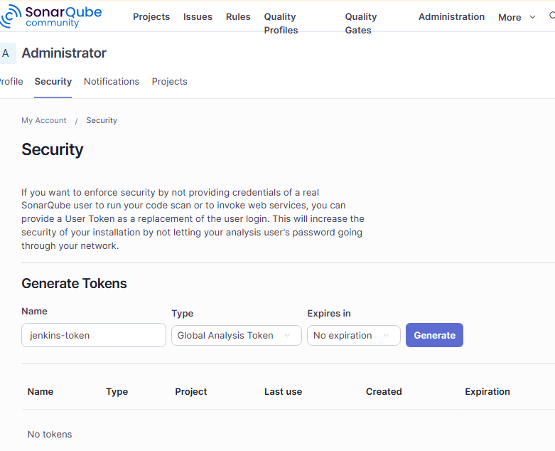

---

### 4. Jenkins connected to SonarQube

**Goal:** Configure Jenkins to send analysis results to SonarQube during pipeline execution.

**Screenshot used:**

* `screenshots/04-jenkins-sonar-config.png`
  **Should show:** SonarQube installation configured inside Jenkins.

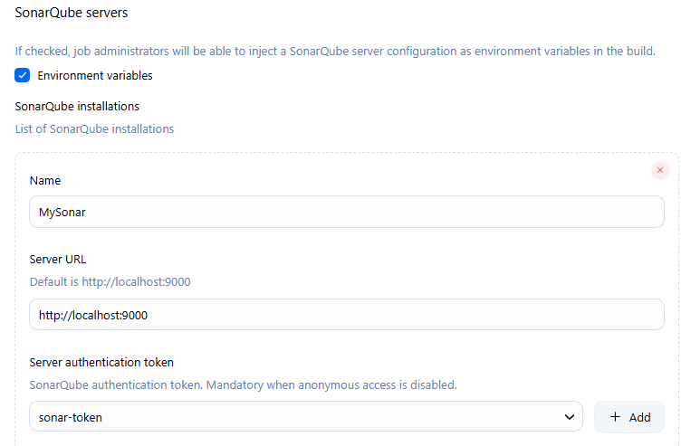

---

### 5. Sonar scanner tool configured

**Goal:** Make sure Jenkins has the scanner tool needed to run Sonar analysis jobs.

**Screenshot used:**

* `screenshots/05-jenkins-sonar-scanner.png`
  **Should show:** Sonar scanner tool configured in Jenkins.

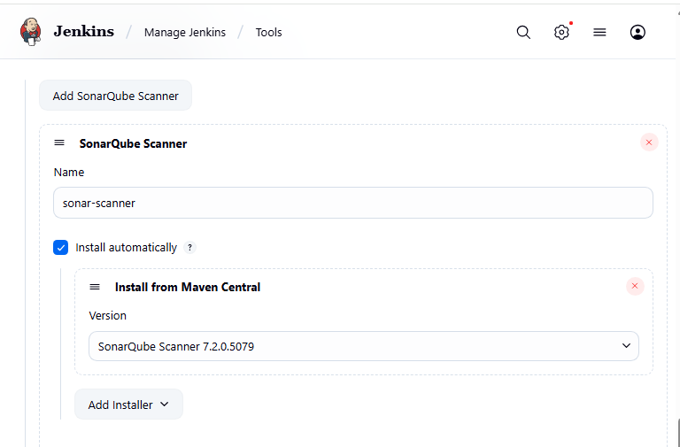

---

### 6. Sonar webhook added

**Goal:** Enable Quality Gate feedback so Jenkins can wait for SonarQube results and fail the pipeline if needed.

**Screenshot used:**

* `screenshots/06-sonar-webhook.png`
  **Should show:** webhook configured in SonarQube.

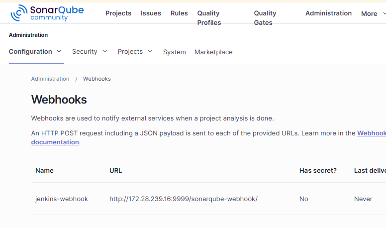

---

### 7. Dependency-Check report generated

**Goal:** Scan project dependencies and identify known vulnerable libraries before deployment.

**Screenshot used:**

* `screenshots/07-dependency-check-report.png`
  **Should show:** generated Dependency-Check report.

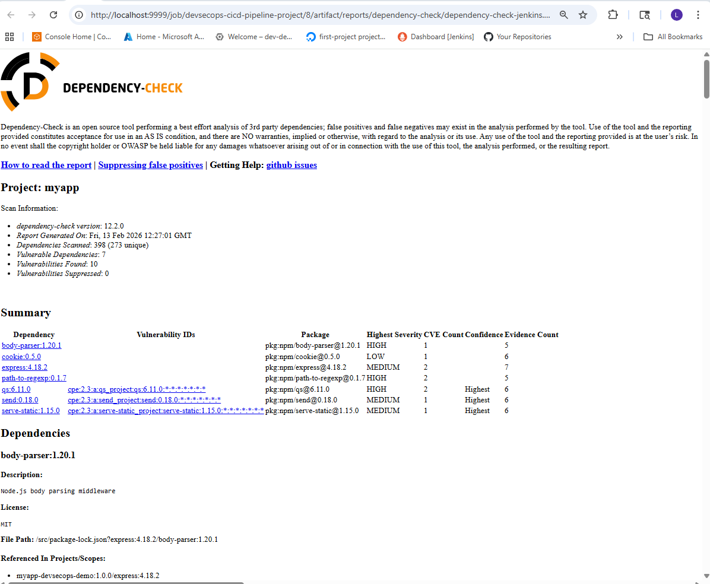

---

### 8. Trivy installed and ready

**Goal:** Prepare container image scanning so the pipeline can detect High/Critical vulnerabilities in Docker images.

**Screenshot used:**

* `screenshots/08-trivy-installed.png`
  **Should show:** Trivy installed successfully.

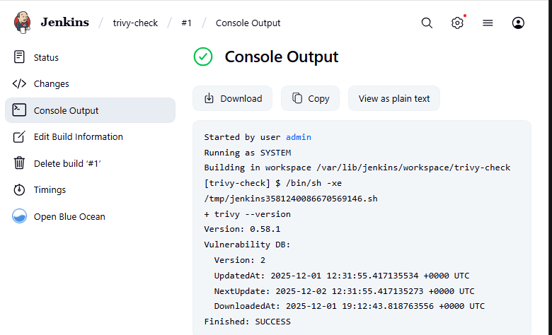

---

### 9. Ingress controller running

**Goal:** Prepare Kubernetes ingress so the application can be reached through a proper entry point.

**Screenshot used:**

* `screenshots/09-ingress-controller-running.png`
  **Should show:** ingress controller pod running.

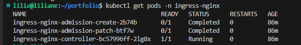

---

### 10. Application running in Kubernetes

**Goal:** Deploy the baseline application successfully before adding GitOps rollout proof.

**Screenshot used:**

* `screenshots/10-app-running.png`
  **Should show:** application accessible in the browser.

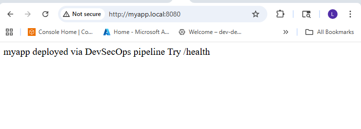

---

### 11. Service health verified

**Goal:** Confirm the application is responding correctly and is healthy.

**Screenshot used:**

* `screenshots/11-service-working.png`
  **Should show:** successful health check response.

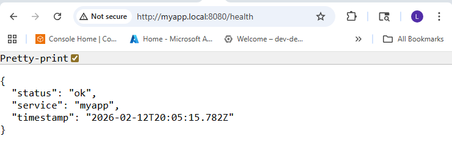

---

### 12. Jenkins pipeline stages completed

**Goal:** Prove the CI/CD pipeline runs through build, scan, and gate stages in Jenkins.

**Screenshot used:**

* `screenshots/12-jenkins-pipeline-stages.png`
  **Should show:** Jenkins stages including SonarQube, Dependency-Check, and Trivy.

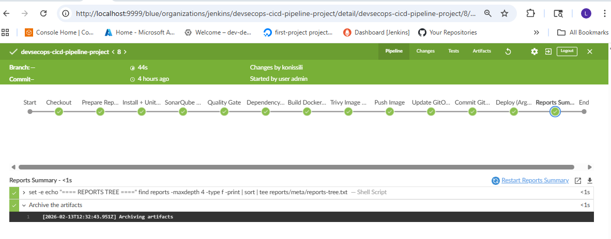

---

### 13. Argo CD application synced

**Goal:** Show the GitOps deployment is working and the cluster state matches Git.

**Screenshot used:**

* `screenshots/13-argocd-app-synced.png`
  **Should show:** Argo CD application marked Synced and Healthy.

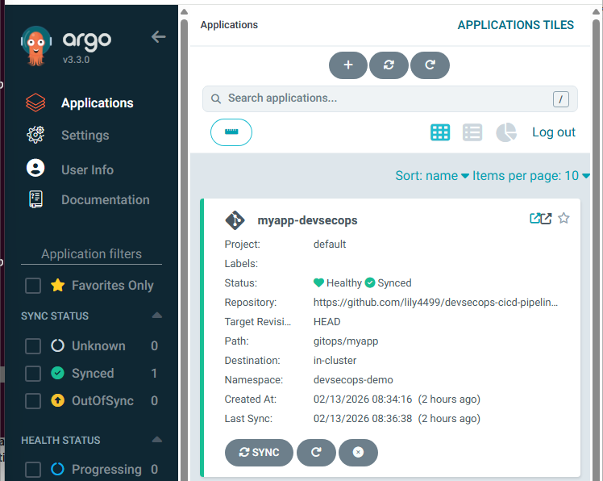

---

### 14. Rollout completed successfully

**Goal:** Confirm the deployment rollout finished correctly after GitOps sync.

**Screenshot used:**

* `screenshots/14-rollout-status.png`
  **Should show:** successful rollout status.

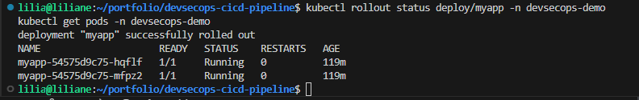

---

## Business Impact

This project improves release safety in a practical way.

Instead of relying on manual review only, the pipeline enforces security checks automatically before deployment. That reduces the chance of insecure code or vulnerable images reaching production.

From an operations and business point of view, this means:

* fewer risky releases
* faster detection of security issues
* less manual verification work
* more confidence in deployments
* easier audit proof with reports and screenshots
* more stable production delivery through GitOps

In short, this pipeline helps turn security into a normal part of delivery instead of a last-minute check.

---

## Troubleshooting

### SonarQube not starting

This usually happens because of Elasticsearch memory or kernel setting requirements.

### Jenkins cannot reach SonarQube

This can happen if Jenkins and SonarQube are not using the right network path, especially in WSL or container-based setups.

### Quality Gate does not return to Jenkins

This usually means the SonarQube webhook is missing or incorrect.

### Dependency-Check is slow

The first run often takes longer because vulnerability data has to be downloaded and cached.

### Trivy scan fails

This can happen if the image was not built correctly, the image tag is wrong, or Trivy cannot access the image.

### Ingress returns 404 or 503

This usually means the ingress, service, or backend endpoints are not correctly connected.

### Argo CD app not syncing

This can happen if the Git repo path is wrong, manifests are invalid, or the destination namespace/resources are unhealthy.

### Rollout stuck

This can happen if pods fail readiness checks, image pull fails, or the deployment manifest points to a bad tag.

---

## Useful CLI

### General verification

```bash
docker ps
kubectl get pods -A
kubectl get svc -A
kubectl get ingress -A
```

### SonarQube checks

```bash
curl -s http://localhost:9000/api/system/status
docker logs -f sonarqube
```

### Jenkins checks

```bash
docker ps
curl -I http://localhost:8080
```

### Dependency-Check report location check

```bash
ls -R reports/dependency-check
```

### Trivy checks

```bash
trivy --version
trivy image <your-image-name>
```

### Kubernetes troubleshooting

```bash
kubectl describe pod <pod-name> -n <namespace>
kubectl logs <pod-name> -n <namespace>
kubectl get endpoints -n <namespace>
kubectl describe svc <service-name> -n <namespace>
kubectl describe ingress <ingress-name> -n <namespace>
```

### Argo CD checks

```bash
kubectl get pods -n argocd
kubectl logs deploy/argocd-server -n argocd
kubectl logs deploy/argocd-application-controller -n argocd
```

### Rollout troubleshooting

```bash
kubectl rollout status deploy/myapp -n devsecops-demo
kubectl describe deploy myapp -n devsecops-demo
kubectl get rs -n devsecops-demo
kubectl get pods -n devsecops-demo -o wide
```

### Image troubleshooting

```bash
docker images
kubectl describe pod <pod-name> -n <namespace>
```

---

## Cleanup

```bash
kubectl delete namespace devsecops-demo --ignore-not-found
kubectl delete namespace argocd --ignore-not-found
docker rm -f sonarqube || true
docker network rm devsecops-net || true
minikube stop
```

---

